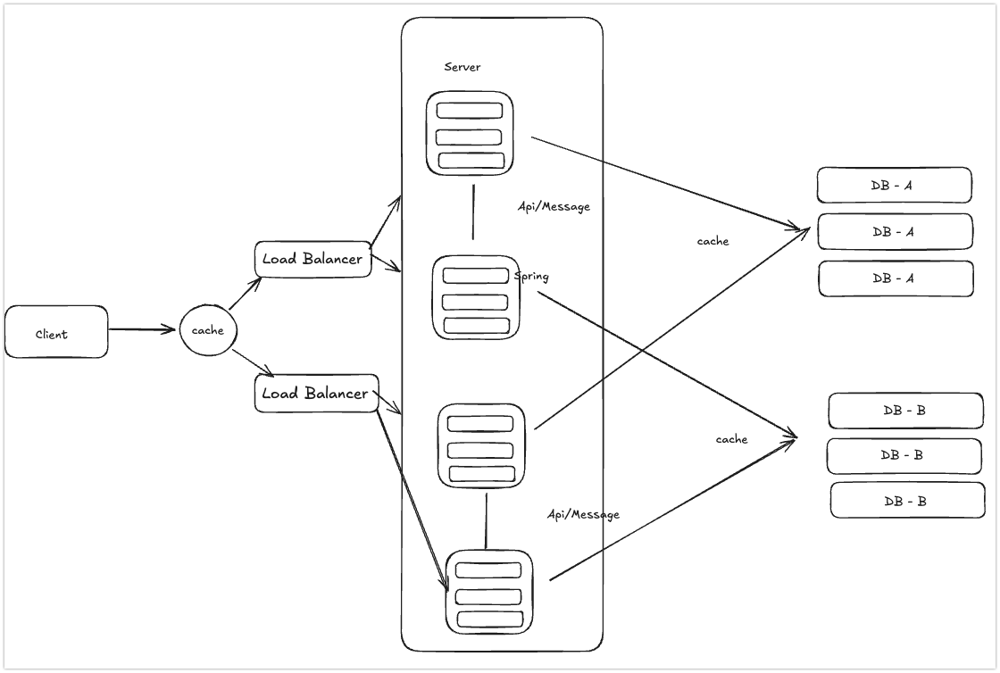

# 대용량 트래픽 PlayGround

---

## 목표
- 대규모 트래픽이 발생하는 상황에서 게시판이 트래픽을 대응하며 대규모 시스템 설계를 학습한다.

## 시나리오 상황 및 아키텍처



### 요구사항
1. MSA 아키텍처로 설계한다.
2. 각 DB가 존재하는 분산 DB 시스템이라고 가정하고 개발한다.
3. 각 DB는 트래픽에 대해서 Scale out을 위해 샤딩을 한다고 가정하며 각 샤드는 논리적 샤드로 처리된다.
4. 이후 MVC 패턴으로 개발한 이유 클린 아키텍처를 적용하여 개발한다.
5. 모든 테스트는 작성하며 최소한의 Mocking을 처리한다.


## 1. 게시판

```sql
private Long articleId;
private String title;
private String content;
private Long boardId; // shard key
private Long writerId;
private LocalDateTime createdAt;
private LocalDateTime modifiedAt;
```

### 1-2. 설계
- 